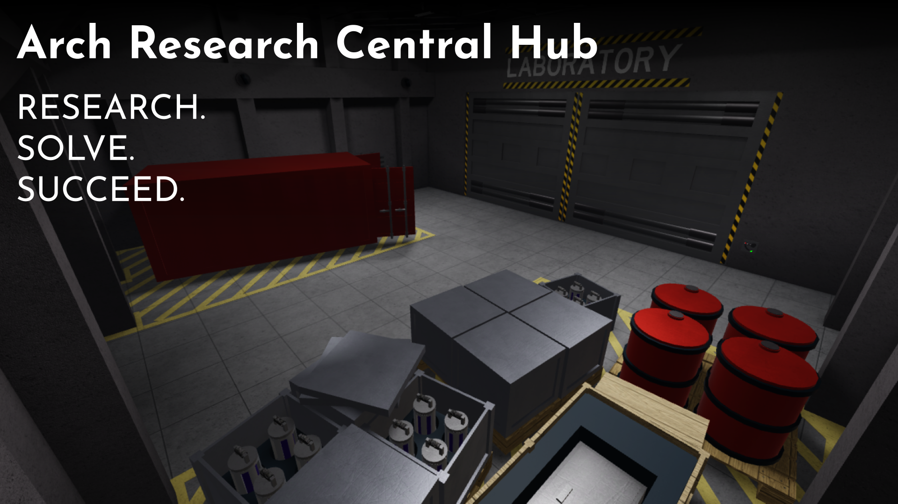
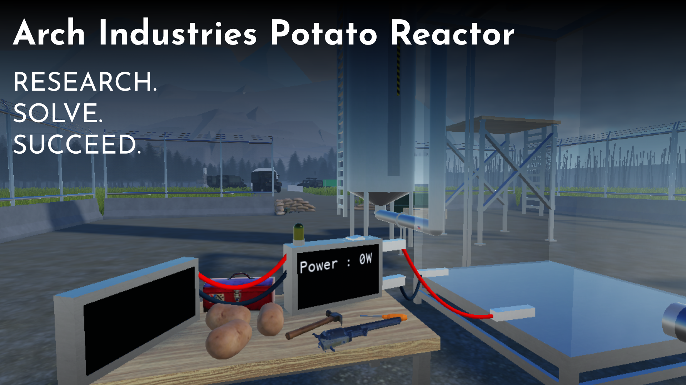
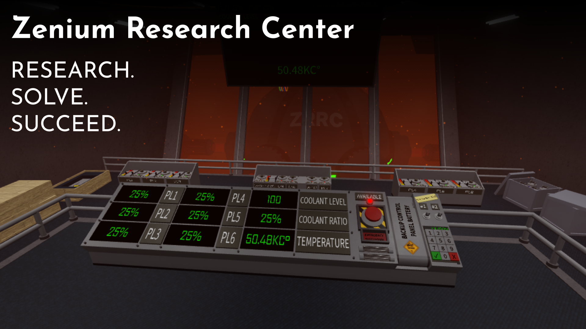
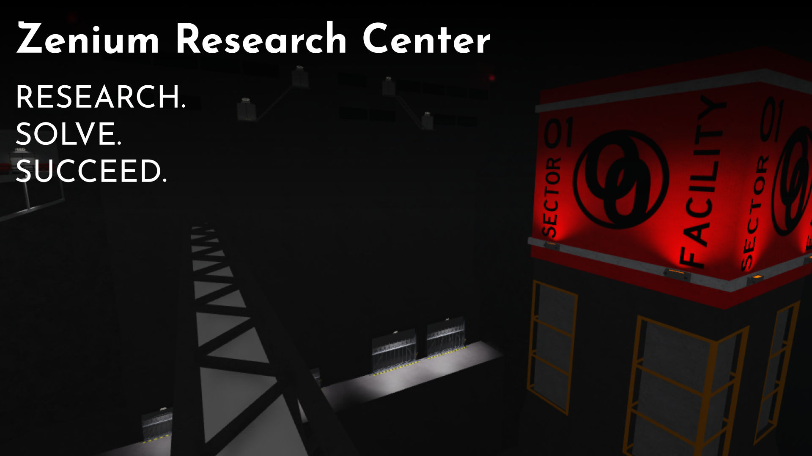

> **_INFO:_** Vous pouvez voir dans le dossier [./img](./img) des images en plus de celles affichées dans ce document.

# A.R.C.H
- Développement commencé en 2022, en solo
- Toujours en développement

[**Lien vers la version en ligne**](https://www.roblox.com/games/8871746612)

# A.I.P.R
- Réalisé en trois jours en 2024, en solo
- Développement terminé

[**Lien vers la version en ligne**](https://www.roblox.com/games/18744063505)

# Z.R.C V2
- Développement commencé en 2020, avec deux autres personnes
- Développement mis en pause en 2022 pour favoriser celui d'A.R.C.H

[**Lien vers la version en ligne**](https://www.roblox.com/games/7096759234)
> La date de création est différente car le jeu a été transférée dans un groupe

# Z.R.C V1
- Développement entre 2019 et 2020, en duo
- Développement annulé pour recommencer une meilleure version

[**Lien vers la version en ligne**](https://www.roblox.com/games/18947596592)
> La date de création est différente car le jeu a été transférée dans un groupe

