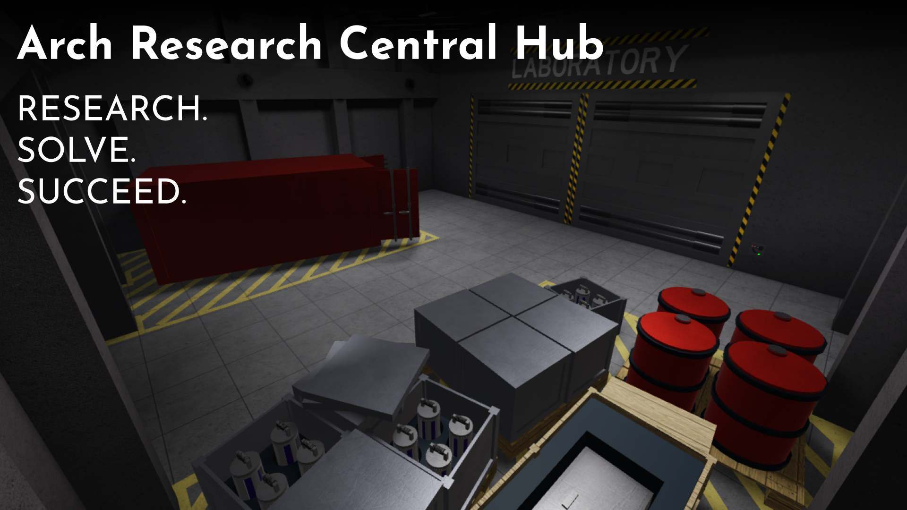
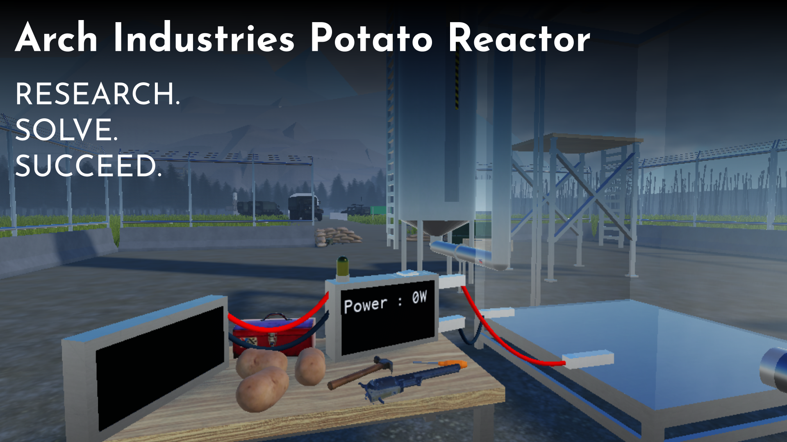
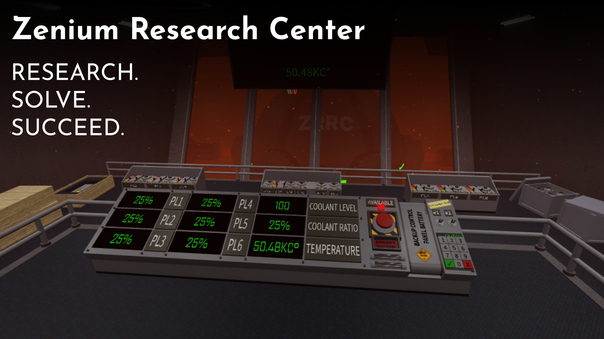
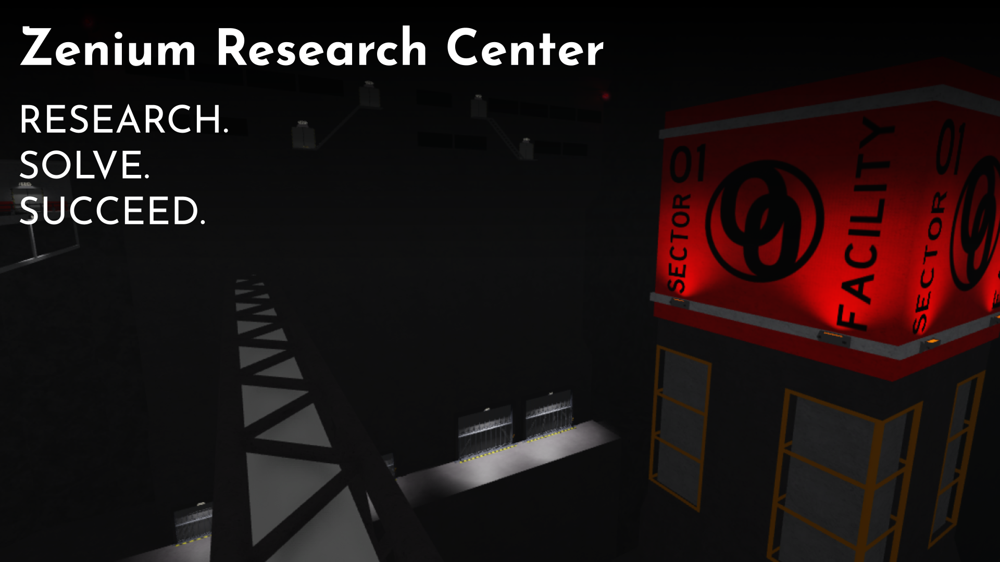

# Roblox Projects

A collection of Roblox games and projects developed over the years.

> **Note:** You can request the files access here : https://github.com/NilsMT/Roblox-games-files

> **Note:** You can view all images in the [./img](./img) directory.

---

## **A.R.C.H (2022–???)**

- **Status:** On Development
- **Development:** Solo
- **Links:**
    - [Play Online](https://www.roblox.com/games/8871746612)
    - [Download File](https://github.com/NilsMT/Roblox-games-files/blob/main/game/A.R.C.H.rbxl)
    - [Development Version File](https://github.com/NilsMT/Roblox-games-files/blob/main/game/A.R.C.H_dev.rbxl)

---

## **A.I.P.R (2024)**

- **Status:** Development finished
- **Development Time:** 3 days (Solo)
- **Links:**
    - [Play Online](https://www.roblox.com/games/18744063505)
    - [Download File](https://github.com/NilsMT/Roblox-games-files/blob/main/game/A.I.P.R.rbxl)

---

## **Z.R.C V2 (2020–2024)**

- **Status:** Development finished
- **Development:** Trio
- **Links:**
    - [Play Online](https://www.roblox.com/games/7096759234)
    - [Download File](https://github.com/NilsMT/Roblox-games-files/blob/main/game/Z.R.C-V2.rbxl)
- **Note:** The creation date differs due to a group transfer.

---

## **Z.R.C V1 (2019–2020)**

- **Status:** Canceled
- **Reason:** Replaced by a better version (Z.R.C V2).
- **Development:** Duo
- **Links:**
    - [Play Online](https://www.roblox.com/games/18947596592)
    - [Download File](https://github.com/NilsMT/Roblox-games-files/blob/main/game/Z.R.C-V1.rbxl)
- **Note:** The creation date differs due to a group transfer.

---
